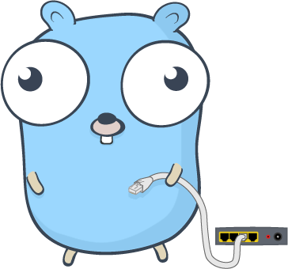

# Philips Hue Remote API Gopher Edition
In order to attain remote api access to Philip Hue bulbs an application must be stood up and used to authenticate against the Hue Remote API as per the [Hue Remote API Authentication Guide](https://developers.meethue.com/develop/hue-api/remote-authentication/). This golang implementation handles the auth process and produces an access token to use as a bearer token in future requests.



### Philips Hue Remote API Application Authentication Steps
1. Make a GET on https://api.meethue.com/oauth2/auth?clientid=$CLIENT_ID&appid=$APP_ID&deviceid=$DEVICE_ID&state=$STATE&response_type=code

2. User logs in and approves access

3. A response with a code is sent to the callback url /?code=$CODE

4. Make a POST to https://api.meethue.com/oauth2/token?code=$CODE&grant_type=authorization_code

5. 401 Auth failed is expected. Will come with nonce, save it.
WWW-Authenticate: Digest realm="oauth2_client@api.meethue.com", nonce="$NONCE"

6. Proceed with Basic or Digest Auth. Digest is more secure so we'll use.

    * Generate a Response that can pass the challenge-reponse handshake.
    `RESPONSE = MD5(HASH1 + “:” + “NONCE” + “:” + HASH2)`
    Where ```HASH1 = MD5(“CLIENTID” + “:” + “REALM” + “:” + “CLIENTSECRET”) => MD5($CLIENT_ID:oauth2_client@api.meethue.com:<clientsecret>), HASH2 = MD5(“VERB” + “:” + “PATH”) => MD5("POST:/oauth2/token")``` Then M=make a POST to https:api.meethue.com/oauth2/token?code=$CODE&grant_type=authorization_code
    Authorization: Digest username="$CLIENT_ID", realm="oauth2_client@api.meethue.com", nonce="$NONCE", uri="/oauth2/token", response="$RESPONSE"

    * Basic Auth is a lot simpler... But not currently implemented here.
    Make a POST on https:api.meethue.com/oauth2/token?code=$CODE&grant_type=authorization_code
    Authorization: Basic <base64(clientid:clientsecret)>

7. There's this bit on Refresh tokens, but I'll get to that later ¯\\_(ツ)_/¯

### TODO
1. ~~Create http golang application for getting auth tokens~~
2. Implement Lambda IaC (Terraform)
3. Implement API Gateway IaC (Terraform)
4. Write second half of application for handling refresh tokens
5. Create database for whitelisting bridges and storing access/refresh tokens
6. Improve documentation around Hue Application registration + initial setup